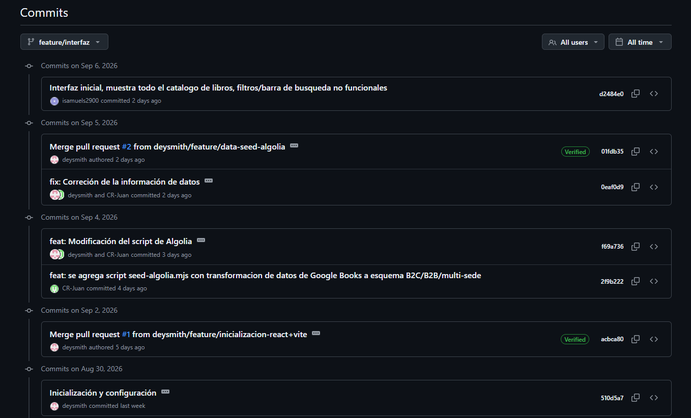

# Laboratorio 2 - E-Commerce

Página web que integra la búsqueda instantánea y filtros avanzados por medio de React y el SDK de Algolia.

## Documentación y Justificación UI/UX

### Introducción

Para el desarrollo de la interfaz del sitio web se siguió un proceso incremental. Inicialmente, la interfaz del catálogo fue desarrollada utilizando HTML y CSS, con el objetivo de definir la estructura visual, distribución de los elementos y experiencia general del usuario antes de incorporar las funcionalidades dinámicas.

La primera versión tomaba en cuenta los elementos principales de una tienda de libros: encabezado, navegación, presentación del catálogo, buscador, filtros, listado de productos mediante tarjetas y pie de página. En esta etapa, los productos eran obtenidos directamente desde un archivo `products.json` y mostrados mediante la iteración de los registros.

Luego, esta interfaz fue tomada como base para el desarrollo del Laboratorio, separando el código en componentes y módulos según su responsabilidad. Esto permitió conservar el diseño inicial mientras se incorporaban funcionalidades como la búsqueda instantánea, filtros avanzados, paginación y manejo dinámico de resultados mediante el SDK de Algolia.

## Documentación y Justificación UI/UX
### **1. Decisiones de Diseño (UI)**
Como se mencionó anteriormente, la interfaz se diseño tomando como base una tienda de libros, buscando mantener una apariencia organizada y consistente. Se utilizaron colores beige, naranja y verde oscuro, utilizando el naranja como color de acento para destacar elementos importantes o interactivos.

Dentro de los componentes proporcionados por Algolia que fueron utilizados en el desarrollo del laboratorio se encuentran:

- **`RefinementList`**: Utilizado para implementar los filtros de categoría, editorial e idioma. Los estilos predeterminados fueron modificados mediante CSS para adaptarlos a la paleta de colores, tipografías y tamaños definidos para la interfaz.
- **`RangeInput`**: Utilizado para implementar el filtro de precio, permitiendo establecer un precio mínimo y máximo.

- **`Hits`**: Utilizado para mostrar los resultados obtenidos de Algolia. En este caso, cada resultado es representado mediante el componente `ProductCard`, conservando el diseño de las tarjetas de productos desarrollado inicialmente.

- **`Pagination`**: Utilizado para dividir los resultados en diferentes páginas cuando existe una cantidad considerable de productos. 
Los productos se presentan por medio de tarjetas individuales, permitiendo visualizar de forma rápida la portada y la información principal de cada libro.

### **2. Experiencia de Usuario (UX)**
La principal funcionalidad implementada mediante Algolia es la búsqueda instantánea. El usuario puede introducir un título, autor, editorial o descripción, y los resultados se actualizan automáticamente conforme escribe, sin necesidad de presionar un botón de búsqueda o recargar la página.

Los filtros se encuentran agrupados en una sección llamada "Explorar", permitiendo separar visualmente las opciones de filtrado del listado de productos. Estos filtros permiten seleccionar diferentes categorías, editoriales, idiomas y rangos de precio. Cuando existen filtros activos, aparece la opción "Borrar filtros", permitiendo eliminar rápidamente los criterios seleccionados y regresar al catálogo completo.

Además, la búsqueda cuenta con tolerancia a errores tipográficos, permitiendo obtener resultados incluso cuando el usuario comete pequeñas equivocaciones al escribir.

A parte de la búsqueda instantánea, se incorporó la opción de búsqueda exacta, permitiendo al usuario alternar entre una búsqueda normal y una búsqueda que prioriza coincidencias exactas. El estado de esta funcionalidad se indica directamente en un botón mediante los textos "Búsqueda exacta activada" y "Búsqueda exacta desactivada", 

Para facilitar la navegación cuando existen muchos productos, se implementó la paginación. 
Esta paginación se encuentra debajo del listado de productos. Esto hace que el usuario revise primero los resultados disponibles y posteriormente avanzar a la siguiente página cuando sea necesario. De esta manera, la paginación no interrumpe la exploración de los productos y evita mostrar una cantidad excesiva de elementos simultáneamente.

Esta disposición facilita el proceso de compra, ya que crea un flujo sencillo en donde el usuario puede pasar de una búsqueda general a una más específica sin abandonar la página ni realizar recargas manuales.
### **3. Manejo de Estados**
Al realizar una búsqueda que no arroja ningún resultado (Empty State). Para detectectar este estado se utiliza la cantidad de resultados proporcionado por Algolia. Cuando `nHits === 0`, en lugar de mostrar la cuadrícula vacía, la interfaz cambia y muestra un mensaje informativo acompañado de una indicación para que el usuario intente realizar otra búsqueda. 

Este manejo del Empty State permite orientar al usuario hacia otra acción: modificar la búsqueda o eliminar los filtros aplicados. Ayudándolo de esta forma a continuar con la navegación del catálogo.

## Nota
Todos los integrantes del Grupo 8 participamos en el desarrollo del laboratorio. Sin embargo, al crear el nuevo repositorio correspondiente al laboratorio, Deywenie realizó la integración de la información contenida en el repositorio del Proyecto 1. Durante este proceso, no se incluyó a los demás integrantes, Ian Samuels y Juan Mora, como colaboradores del nuevo repositorio.

Por lo anterior, el historial y la lista de colaboradores del nuevo repositorio no reflejan la participación de todos los integrantes del grupo en el desarrollo del laboratorio.

En la siguiente imagen se muestra la rama más reciente del repositorio del Proyecto 1 (`feature/interfaz`), donde se puede mostrar la participación de los integrantes en el desarrollo previo. 

